# How dpm.lol Does LP History — Full Breakdown & Replication Plan

> Reverse-engineered from the captured `rank-history` payload, then verified against the live Riot API.
> Every number in the "Verified" sections was measured during this analysis, not recalled.
> Claims are tagged **[V]** verified, **[O]** observed in the captured payload, **[I]** inferred.

---

## 0. The answer, in three sentences

1. **Riot does not expose LP history. Nobody can fetch it.** `league-v4` returns a single point-in-time reading; `match-v5` contains no LP at all. Every LP graph on every site is a time series that site recorded itself.
2. **dpm.lol has your history because they crawl the entire ranked ladder on a schedule** — not because you visited. `league-v4/entries/{queue}/{tier}/{division}` returns **205 players per request** including `puuid`, `leaguePoints`, `wins` and `losses`. I measured it: **~7,300 requests snapshots all ~1.5 million ranked solo-queue players on EUNE — about 3 minutes on a production key.** **[V]**
3. **It was fast because nothing in that request touched Riot.** `widgets/rank-history` is a single indexed read of 27 pre-computed daily rows out of their own database — a 3.6 kB response with every derived value already calculated at write time.

The uncomfortable corollary: **you cannot backfill what you never recorded.** The only way to have February's LP is to have been writing it down in February. The engineering task is not "fetch history" — it is "start a recorder, today, that cannot miss."

---

## 1. What the payload actually is

### 1.1 The request **[O]**

```
GET https://dpm.lol/v1/players/{playerId}/widgets/rank-history
```

Response headers from the capture:

| Header | Value | What it tells you |
|---|---|---|
| `Server` | `cloudflare` | Cloudflare in front |
| `X-Powered-By` | `Express` | Node/Express origin |
| `Cf-Cache-Status` | `BYPASS` | Cloudflare deliberately **not** caching this |
| `X-Cache` | `MISS` | Their *own* application cache layer, missed |
| `Etag` | `W/"e03-mt8bEFqSBXe86Phbgivd56VDgDA"` | Weak ETag → 304 on repeat. Express encodes the body length in hex here: `0xe03` = **3,587 bytes** |
| `Content-Encoding` | `gzip` | ~1 kB on the wire |

Two things worth stealing immediately:

- **The URL is `/widgets/<name>`.** The profile page fires `rank-history`, `best-champs`, `played-with`, `role-stats`, `recent-performances`, `match-history`, `pings`, `champions`, `live`, `aram` as **independent parallel requests** (visible in the network panel). One slow widget cannot block the page, and each gets its own cache policy and its own ETag. This is why the page paints instantly even though the full profile is megabytes of data.
- **`X-Cache: MISS` next to `Cf-Cache-Status: BYPASS`** means they run an application-level cache (Redis or in-process) and intentionally keep Cloudflare out of it — correct for per-player data that must invalidate the moment "Update now" is pressed.

### 1.2 The response shape **[O]**

```jsonc
{
  "averageRank": { "tier": "EMERALD", "rank": "I", "leaguePoints": 13 },
  "peakElo":     { "tier": "EMERALD", "rank": "I", "leaguePoints": 67, "score": 2867 },
  "leaguepointsToChallenger": null,
  "leaguepointsToGrandmaster": null,
  "histogram": [
    {
      "date": "2026-02-15",     // one row per DAY, not per game
      "tier": "PLATINUM",
      "rank": "I",
      "leaguePoints": 57,
      "score": 2457,            // ← the whole trick, decoded below
      "games": 2,               // games played that day
      "difference": 0,          // score delta vs previous row
      "previousScore": 0
    },
    // ... ~27 rows spanning 2026-02-15 → 2026-08-06
  ]
}
```

### 1.3 `score` decoded — and proven **[V]**

`score` is a **single monotonic integer that collapses tier + division + LP into one number you can plot on a Y axis.** You cannot chart "Emerald III 43 LP" directly; you can chart `2643`.

```js
const TIERS = ['IRON','BRONZE','SILVER','GOLD','PLATINUM','EMERALD','DIAMOND'];
const DIVISION = { IV: 0, III: 100, II: 200, I: 300 };
const APEX_BASE = 500 + TIERS.length * 400; // 3300 — Master IV-equivalent floor

function score(tier, division, leaguePoints) {
  const i = TIERS.indexOf(tier);
  // Master / Grandmaster / Challenger have no divisions: one shared floor and
  // LP counts upward without bound. Never look up DIVISION[] for them.
  if (i === -1) return APEX_BASE + leaguePoints;
  return 500 + i * 400 + DIVISION[division] + leaguePoints;
}
```

Checked against **all 17** `(tier, rank, lp) → score` tuples visible in the capture:

```
PASS  PLATINUM I   57 LP -> 2457   PASS  EMERALD II    0 LP -> 2700
PASS  PLATINUM I   77 LP -> 2477   PASS  EMERALD II   27 LP -> 2727
PASS  EMERALD IV   57 LP -> 2557   PASS  EMERALD II   39 LP -> 2739
PASS  EMERALD III  66 LP -> 2666   PASS  EMERALD II    4 LP -> 2704
PASS  EMERALD III  43 LP -> 2643   PASS  EMERALD II   61 LP -> 2761
PASS  EMERALD III  86 LP -> 2686   PASS  EMERALD II   90 LP -> 2790
PASS  EMERALD III  79 LP -> 2679   PASS  EMERALD I    46 LP -> 2846
PASS  EMERALD I    67 LP -> 2867   PASS  EMERALD I    28 LP -> 2828
PASS  EMERALD I    67 LP -> 2867  (peakElo)

17/17 match
```

Structure: **100 per division, 400 per tier, +500 constant.** The `+500` is arbitrary headroom below Iron IV (room for unranked/provisional sentinels) — it carries no meaning and any constant works, as long as it never changes once you have data on disk.

> ⚠️ All 17 confirmed samples are Platinum/Emerald, so the *within-ladder* structure (100/division, 400/tier) is verified directly while the apex handling above is the consistent extension, not a measured fact.

> **You already implement this exact scheme.** [`database.js:9-29`](apps/electron/database.js#L9-L29) — `computeAbsoluteLp()` uses 400/tier and 100/division, with Iron IV at `0` instead of `500`. Your math is identical; only the constant differs, and the constant is meaningless. **You solved this part already.**

### 1.4 The derived fields

| Field | What it is | Confidence |
|---|---|---|
| `peakElo` | `MAX(score)` over the series. Verified: max of visible points = 2867 = `peakElo.score`. | **[V]** |
| `difference` | `score - previousScore`. Precomputed at write time so the client never diffs. | **[O]** |
| `games` | Games played that day. Almost certainly `Δ(wins + losses)` between consecutive ladder observations — those two fields ship in every ladder entry. | **[I]** |
| `leaguepointsToChallenger` / `ToGrandmaster` | `apexCutoff - score`, `null` below Diamond. Cutoffs come free from the apex-league endpoints. | **[I]** |
| `averageRank` | Rendered as **"MMR"** in the UI. It is **not** the mean of the histogram — I computed that mean as `2695` vs the payload's `2813`. Most plausibly the average rank of players in recent lobbies, which is the standard MMR proxy and is a trivial join against the same ladder-snapshot table. | **[I]** |

### 1.5 Why the histogram has gaps **[I]**

The series skips 2026-02-18/19, then jumps 2026-03-19 → 2026-05-10. But it *does* contain consecutive days with identical LP (02-16 and 02-17 both at 77 LP / 2477).

That pattern rules out "write a row only when LP changes" and rules out "write a row every day". What fits both facts: **write a row when the player's `wins + losses` changed since the last observation** — i.e. one row per *active day*. Identical-LP rows are days where a win and a loss cancelled out; gaps are days with no games. The `games` field is that same delta, persisted.

Also note 2026-03-19 (2557) → 2026-05-10 (2557): a seven-week gap with the value carried across unchanged. That is inactivity, not a split reset — useful to know, because it means their chart interpolates flat across gaps rather than dropping to zero.

---

## 2. Why this is hard: Riot gives you nothing

This is the part worth internalising before any code gets written.

| What you want | Endpoint that provides it | Reality |
|---|---|---|
| LP right now | `league-v4/entries/by-puuid/{puuid}` | ✅ point-in-time only, no history |
| LP after a specific match | — | ❌ **does not exist** |
| LP 3 months ago | — | ❌ **does not exist** |
| Rank history | — | ❌ **does not exist** |
| Your MMR | — | ❌ never exposed, at all |

`match-v5` gives you kills, gold, timelines, item builds — and **zero LP information**. There is no field for it. Sites that show "+18 LP" next to a match either (a) recorded LP before and after that match themselves, or (b) estimated it.

So the entire competitive advantage of dpm.lol/op.gg/League of Graphs on this feature is **"we started recording earlier than you did, and we never stop."** It is a data-collection moat, not an algorithm.

---

## 3. The actual trick: crawl the ladder, not the player

Here is the leap. The naive model is *"user searches a player → we look that player up → we store a row."* That gives you history only for players someone has already searched, starting from the moment they were first searched. It cannot produce a February start date for a player who arrived in August.

The real model inverts it:

> **Don't ask Riot about players. Ask Riot for the ladder, and get every player at once.**

### 3.1 The endpoint that makes it viable **[V — measured live]**

```
GET https://{platform}.api.riotgames.com/lol/league/v4/entries/RANKED_SOLO_5x5/{tier}/{division}?page={n}
```

Measured against `eun1` during this analysis:

- **205 entries per page**, exactly, on every full page.
- ~53 KB uncompressed / ~14.5 KB gzipped per page.
- Each entry contains everything the recorder needs, with **no follow-up call**:

```jsonc
{
  "queueType": "RANKED_SOLO_5x5",
  "tier": "EMERALD",
  "rank": "I",
  "puuid": "jBajp7abxKgMT9Lpv_yg8_rxuuwq0z9bRcnEuYcWVp199Dnzq6vEAJpFOzgZqanfoGMSFtQ8nQLpvA",
  "leaguePoints": 45,
  "wins": 27,          // ← Δ(wins+losses) = games played = the `games` field
  "losses": 24,
  "veteran": false,
  "inactive": false,   // ← decay flag, matters for gap handling
  "freshBlood": false,
  "hotStreak": false
}
```

> ⚠️ **This is newer than most tutorials.** Older guides (including hextechdocs) warn that `league-v4` returns `summonerId` while `match-v5` needs `puuid`, costing **one extra request per player** — which would have made this approach ~200× more expensive and is why it was historically impractical for hobbyists. **Riot now returns `puuid` directly in the ladder entry.** I confirmed it in the live response above. The extra hop is gone. This endpoint is dramatically cheaper than the internet thinks it is.

### 3.2 Measured cost of a full sweep — EUNE, solo queue **[V]**

I binary-searched the last non-empty page of **all 28 tier/division buckets** on `eun1`. The total page count *is* the sweep cost, so this is a measurement, not an estimate:

| Tier | Pages | ≈ Players |
|---|---:|---:|
| IRON | 264 | 54,120 |
| BRONZE | 1,180 | 241,900 |
| SILVER | 1,520 | 311,600 |
| GOLD | 1,700 | 348,500 |
| PLATINUM | 1,352 | 277,160 |
| EMERALD | 968 | 198,440 |
| DIAMOND | 300 | 61,500 |
| MASTER | 1 | ~10,000 |
| GRANDMASTER | 1 | 500 |
| CHALLENGER | 1 | 200 |
| **TOTAL** | **≈ 7,287 requests** | **≈ 1,503,920 players** |

Apex tiers (`masterleagues` / `grandmasterleagues` / `challengerleagues` + `/by-queue/RANKED_SOLO_5x5`) return the **entire league in a single request** — 3 requests, no pagination. They also hand you the Challenger/GM LP cutoffs for free, which is where `leaguepointsToChallenger` comes from.

*(Page counts round up to whole pages and carry ±4 pages of search tolerance, so treat them as tight upper bounds. Master returning exactly 10,000 looks like an endpoint cap rather than the true league size.)*

### 3.3 The economics

**~7,300 requests captures the current LP of every ranked solo-queue player on EUNE — about 1.5 million people.**

| | Sustained rate | Time for one full EUNE sweep |
|---|---|---|
| Development / personal key | 0.83 req/s | **≈ 2.4 hours** |
| Production key | 50 req/s | **≈ 3 minutes** |

Three minutes. Once a day. That is the entire cost of having a daily LP graph for every ranked player on a region.

Two properties make this design win, and both are worth stating plainly:

- **Cost scales with ladder size, not user count.** Ten users or ten million, the crawl is the same ~7,300 requests. Per-player lookups scale with *traffic*; this scales with *nothing you control*, which is the good kind of constant.
- **It is retroactive from the user's point of view.** A player who has never visited your site still has six months of graph, because you were recording the whole ladder the whole time. This is the only mechanism that produces that experience, and it is exactly why the dpm.lol profile had history back to February.

Scaling out: flex queue doubles it, and every platform adds its own sweep (each with its **own independent rate-limit budget** — Riot's limits are per-key *per-region*, so regions never contend with each other). Global coverage of both queues lands in the low hundreds of thousands of requests per day, which averages to a few requests per second. Comfortably inside a single production key.

---

## 4. Why the request was so fast

Because it never talked to Riot.

```mermaid
flowchart LR
    subgraph Offline["Background — runs on a schedule, nobody is waiting"]
        R[Riot league-v4<br/>ladder sweep] -->|~7.3k requests<br/>once per day, ~3 min| W[Crawler]
        W --> D[(rank_snapshots<br/>one row per player per active day)]
    end

    subgraph Online["Request path — user is waiting"]
        U[Profile page] -->|GET /widgets/rank-history| E[Express]
        E --> C{App cache<br/>X-Cache}
        C -->|hit| U
        C -->|miss| D
        D -->|single indexed read<br/>27 rows| E
        E -->|gzip · ETag · 3.6 kB| U
    end

    style Offline fill:#1a2332,stroke:#3d5a80
    style Online fill:#2d1b2e,stroke:#8d5a80
```



**The entire cost of the user-facing request is one indexed range scan.**

```sql
SELECT day, tier, division, league_points, score, games
FROM rank_snapshots
WHERE puuid = ? AND queue = 'RANKED_SOLO_5x5'
ORDER BY day;
```

**27 rows.** `score`, `difference` and `games` were computed at **write** time, so the API does no arithmetic at all — it selects rows and serialises them.

How small is the response really? Express builds weak ETags as `W/"<byte-length-in-hex>-<hash>"`, so their own header tells us: `W/"e03-…"` → `0xe03` = **3,587 bytes** uncompressed, roughly 1 kB gzipped.

> The `23.4 kB` in the DevTools status bar is the total across all **25** filtered XHR requests on the page, not this one response. The rank-history payload is ~3.6 kB — the *whole profile's* API surface is 23 kB. That makes the point stronger, not weaker.

Sub-100ms is the *expected* result here, not an optimisation.

Contrast with the naive design — call Riot on page load, compute history on the fly — which is 500-2000ms *at best*, fails when Riot is degraded, and burns rate-limit budget proportional to your traffic.

**The speed is not a trick. It is the direct consequence of moving all the work off the request path.** Every fast stats site is fast for this same reason.

---

## 5. Where LoLVault stands today

You are much closer than you'd think — and one architectural decision away from being much further.

### ✅ Already correct

| Piece | Where | Note |
|---|---|---|
| Absolute-LP scale | [`database.js:9-29`](apps/electron/database.js#L9-L29) | Same 400/tier + 100/division scheme as dpm.lol's `score` |
| Snapshot table + index | [`database.js:38-51`](apps/electron/database.js#L38-L51) | `lp_snapshots(account_id, timestamp)` indexed |
| Inverse (score → label) | [`lp-climb-chart.component.ts:25`](apps/electron/src/app/pages/analytics/widgets/lp-climb-chart.component.ts#L25) | `absoluteLpToLabel()` |
| Per-match LP columns | [`database.js`](apps/electron/database.js) `match_cache` | `lp_before`, `lp_after`, `lp_delta` already exist |
| Pre/post-game capture | [`lcu-monitor.js:148-178`](apps/electron/lcu-monitor.js#L148-L178) | Snapshots at `ChampSelect` and `EndOfGame` |
| Refresh-time capture | [`acc-card.component.ts:409-432`](apps/electron/src/app/components/acc-card/acc-card.component.ts#L409-L432) | `syncLpTrend()` appends on manual account refresh |
| Correct modern endpoint | [`riot-api.service.js:217`](apps/electron/riot-api.service.js#L217) | Already using `entries/by-puuid` |
| Global rate limiter | [`rate-limiter.js`](apps/electron/rate-limiter.js) | Priority queue, 429 backoff — genuinely good |

### ❌ The six gaps

1. **Every snapshot path requires the app to be open.** There are two recorders — [`lcu-monitor.js`](apps/electron/lcu-monitor.js) on `ChampSelect`/`EndOfGame`, and `syncLpTrend()` on manual account refresh — and neither can fire while LoLVault is closed. Play a weekend with the app shut and that weekend is gone forever. The comment in [`lp-trend-mini.component.ts:26-30`](apps/electron/src/app/pages/analytics/widgets/lp-trend-mini.component.ts#L26-L30) is admirably honest about the result — *"a couple of readings months apart and three within the same hour."* **This is the #1 fix and it is cheap.**

2. **The dedupe rule silently discards real activity.** [`acc-card.component.ts:415-421`](apps/electron/src/app/components/acc-card/acc-card.component.ts#L415-L421) only writes when tier, division **or LP** changed:

   ```ts
   const moved = !latest || latest.tier !== ... || latest.lp !== soloQueue.leaguePoints;
   if (moved) { await window.electronAPI.saveLpSnapshot({ ... }); }
   ```

   A day where you went 1W–1L and netted zero LP writes **nothing**. That is exactly the case dpm.lol *does* record — their 2026-02-16 and 02-17 rows both sit at 77 LP with `games > 0`. Deduping on LP throws away the games-played signal; dedupe on **`(account, queue, day)`** instead and let the row upsert. That one change is the difference between "how much LP did I have" and "how much did I play and what did it get me."

3. **No daily bucketing.** `lp_snapshots` is append-only with raw `timestamp`. Three snapshots in one hour produce three points. dpm.lol stores **one row per player per day**, which is what makes the graph legible and the payload small.

4. **No `games` / `difference` columns.** These are computed at write time by dpm.lol so reads are free.

5. **The chart component is dead code.** `LpClimbChartComponent` is defined but never rendered anywhere — only `lp-trend-mini` is used, in [`queue-card.component.ts:56`](apps/electron/src/app/pages/analytics/widgets/queue-card.component.ts#L56). You built the graph and never mounted it.

6. **Development API key — the hard blocker.** Confirmed live from the response headers:
   ```
   X-App-Rate-Limit: 100:120,20:1          ← 100 requests per 2 minutes
   X-Method-Rate-Limit: 50:10              ← 50 per 10s on league-v4 entries
   ```
   Those match Riot's published dev/personal-key limits exactly. Production keys start at **500 req/10s and 30,000 req/10min**:

   | Key | Burst | Sustained | Relative |
   |---|---|---|---|
   | Development / personal | 20/s | **0.83 req/s** (100 per 2 min) | 1× |
   | Production | 500 per 10s | **50 req/s** | **60×** |

   The 2-minute window is the binding constraint on a dev key — your [`rate-limiter.js:19`](apps/electron/rate-limiter.js#L19) comment already says exactly this. A full EUNE sweep is **~3 minutes** on a production key and **~2.4 hours** on a dev key. Dev keys also **expire every 24 hours**, which alone rules them out for any unattended recorder.

### 🔴 Security issue found along the way

```
apps/electron/src/environments/environment.ts:2:       riotApiKey: 'RGAPI-eab67407-…'
apps/electron/src/environments/environment.development.ts:2: riotApiKey: 'RGAPI-eab67407-…'
```

A live Riot API key is **committed to git and bundled into the shipped Electron app**. Anyone who downloads the app can extract it in seconds and burn your rate limit or get your key revoked. It is a dev key so the blast radius is small today — but this pattern must not survive contact with a production key, which is a *credential Riot holds you accountable for*. Move it server-side (see §6.3) or at minimum to runtime user-supplied config with the existing `setEncryptedSetting` path.

---

## 6. Replication plan

Three tiers. Each is independently shippable and each is worth doing on its own.

### 6.1 Tier 0 — Fix the recorder you already have *(hours, no new infrastructure)*

The single highest-value change in this document. Stop only recording during games; record on a **heartbeat**.

**Schema — add daily bucketing and precomputed deltas:**

```js
// database.js — append to MIGRATIONS (v5 → v6). Never reorder existing entries.
(d) => {
  d.exec(`
    CREATE TABLE IF NOT EXISTS rank_snapshots (
      account_id    TEXT    NOT NULL,
      queue         TEXT    NOT NULL,   -- RANKED_SOLO_5x5 | RANKED_FLEX_SR
      day           TEXT    NOT NULL,   -- 'YYYY-MM-DD', local date
      tier          TEXT    NOT NULL,
      division      TEXT    NOT NULL,
      league_points INTEGER NOT NULL,
      score         INTEGER NOT NULL,   -- absolute LP, = computeAbsoluteLp()
      wins          INTEGER,            -- season totals, from league-v4
      losses        INTEGER,
      games         INTEGER DEFAULT 0,  -- Δ(wins+losses) vs previous row
      difference    INTEGER DEFAULT 0,  -- score - previous score
      observed_at   INTEGER NOT NULL,   -- last write this day, ms
      PRIMARY KEY (account_id, queue, day)
    );

    CREATE INDEX IF NOT EXISTS idx_rank_snapshots_series
      ON rank_snapshots (account_id, queue, day);
  `);
}
```

`PRIMARY KEY (account_id, queue, day)` is the whole design. Writing twenty times a day is harmless — the row is upserted, and the last write of the day wins. That makes the recorder **idempotent**, which is what lets you poll aggressively without bloating the series.

**The upsert, with deltas computed at write time:**

```js
function recordRankSnapshot(accountId, queue, entry, when = Date.now()) {
  const { tier, rank: division, leaguePoints, wins, losses } = entry;
  const score = computeAbsoluteLp(tier, division, leaguePoints);
  const day = new Date(when).toLocaleDateString('en-CA'); // YYYY-MM-DD, local

  // Previous row *before today* — the baseline for this day's deltas.
  const prev = getDb()
    .prepare(
      `SELECT score, wins, losses FROM rank_snapshots
        WHERE account_id = ? AND queue = ? AND day < ?
        ORDER BY day DESC LIMIT 1`
    )
    .get(accountId, queue, day);

  const difference = prev ? score - prev.score : 0;
  const games = prev ? (wins + losses) - (prev.wins + prev.losses) : 0;

  getDb()
    .prepare(
      `INSERT INTO rank_snapshots
         (account_id, queue, day, tier, division, league_points, score,
          wins, losses, games, difference, observed_at)
       VALUES (?, ?, ?, ?, ?, ?, ?, ?, ?, ?, ?, ?)
       ON CONFLICT(account_id, queue, day) DO UPDATE SET
         tier          = excluded.tier,
         division      = excluded.division,
         league_points = excluded.league_points,
         score         = excluded.score,
         wins          = excluded.wins,
         losses        = excluded.losses,
         games         = excluded.games,
         difference    = excluded.difference,
         observed_at   = excluded.observed_at`
    )
    .run(accountId, queue, day, tier, division, leaguePoints, score,
         wins ?? null, losses ?? null, games, difference, when);
}
```

**Call it from four places** — the more triggers, the fewer holes:

| Trigger | Where | Why |
|---|---|---|
| App launch | `main.js` startup | Catches everything that happened while closed |
| Every 6 h while running | `setInterval` in main | Cheap heartbeat, 4 req/account/day |
| LCU `EndOfGame` | [`lcu-monitor.js:222`](apps/electron/lcu-monitor.js#L222) | Already implemented — just also write the daily row |
| Manual refresh | Existing analytics refresh | User-initiated freshness |

At 4 accounts × 4 polls/day = **16 requests/day**. Against a dev key's 100-per-2-minutes budget, that is a rounding error.

**Also do these two, they're nearly free:**

- **Mount the chart you already wrote.** `LpClimbChartComponent` exists and works — render it in the analytics shell against the new daily series.
- **Seed a first data point on account add.** In [`acc-card.component.ts:415`](apps/electron/src/app/components/acc-card/acc-card.component.ts#L415) you already fetch rank on add — write a snapshot immediately so day 1 exists.

> ⚠️ **Tier 0 does not give you retroactive history.** Nothing does. It guarantees that from the day you ship it, the series is complete and gap-free — which is the only thing that was ever available to dpm.lol either.

### 6.2 Tier 1 — Server-side per-account recorder *(days, Firebase)*

Tier 0's flaw: it needs the desktop app installed and occasionally opened. Move the heartbeat to the backend you already have (`backend/functions`) and the recording becomes unconditional, plus history syncs to the web app.

```js
// backend/functions/src/index.ts
export const recordRankSnapshots = onSchedule(
  { schedule: 'every 6 hours', secrets: ['RIOT_API_KEY'] },
  async () => {
    const accounts = await db.collection('trackedAccounts').get();

    for (const doc of accounts.docs) {
      const { puuid, platform } = doc.data();
      const entries = await riotFetch(
        `https://${platform}.api.riotgames.com/lol/league/v4/entries/by-puuid/${puuid}`
      );

      for (const entry of entries) {
        const day = new Date().toISOString().slice(0, 10);
        // Same upsert semantics: doc id is the dedupe key.
        await db.doc(`rankSnapshots/${puuid}_${entry.queueType}_${day}`)
                .set({ ...toSnapshot(entry), day }, { merge: true });
      }
    }
  }
);
```

- **Cost:** 1 request per account per queue per run. 1,000 accounts × 4 runs/day ≈ 4,000 req/day — still trivially inside a dev key's *daily* volume, though you'd want a production key for the burst headroom.
- **Firestore doc id `{puuid}_{queue}_{day}`** gives you the same idempotent daily upsert as the SQLite primary key.
- **Now the key lives in a secret**, not in `environment.ts` — this fixes §5's security issue as a side effect.

### 6.3 Tier 2 — The real thing: a ladder crawler *(weeks, production key required)*

Only worth building if you want history for **arbitrary** players — opponents from your match history, searched profiles, players who never installed anything. That is exactly the dpm.lol product, and it is the only path to it.

**Prerequisites, in order:**

1. **A production API key.** Requires a working public-facing product, a privacy policy, and Riot's approval. This is a *process*, not a checkbox — start it early because it gates everything else.
2. **A long-running host.** Cloud Functions time out; a sweep runs for minutes. Use Cloud Run (with min-instances), a scheduled Cloud Run Job, or a small VPS.
3. **Postgres, not Firestore.** A ladder sweep is millions of writes per region per day. Firestore per-document write pricing makes that ruinous; Postgres bulk `COPY`/multi-row upsert makes it near-free.

**Schema:**

```sql
CREATE TABLE rank_snapshots (
  -- A puuid is 78 chars and would dominate every row. Intern it into a
  -- players(id, puuid) table and key on the id instead — see "Storage" below,
  -- it is a ~2.4x saving on the biggest table you will own.
  puuid         TEXT    NOT NULL,
  platform      TEXT    NOT NULL,
  queue         SMALLINT NOT NULL,
  day           DATE    NOT NULL,
  tier          SMALLINT NOT NULL,   -- enum ordinal, not text
  division      SMALLINT NOT NULL,
  league_points SMALLINT NOT NULL,
  score         INTEGER  NOT NULL,
  wins          SMALLINT,
  losses        SMALLINT,
  games         SMALLINT DEFAULT 0,
  difference    SMALLINT DEFAULT 0,
  PRIMARY KEY (puuid, queue, day)
) PARTITION BY RANGE (day);

-- The only query the widget endpoint ever runs.
CREATE INDEX idx_rank_series ON rank_snapshots (puuid, queue, day);
```

Partition by day (or month) so old splits detach in O(1) instead of a multi-hour `DELETE`.

**Crawler skeleton:**

```js
const TIERS = ['IRON','BRONZE','SILVER','GOLD','PLATINUM','EMERALD','DIAMOND'];
const DIVISIONS = ['IV','III','II','I'];

async function sweepPlatform(platform, queue = 'RANKED_SOLO_5x5') {
  const day = new Date().toISOString().slice(0, 10);

  // 28 paginated buckets. Run a few concurrently; the limiter is the real gate.
  for (const tier of TIERS) {
    for (const div of DIVISIONS) {
      for (let page = 1; ; page++) {
        const entries = await limiter.enqueue(() =>
          riotFetch(`https://${platform}.api.riotgames.com/lol/league/v4/entries/${queue}/${tier}/${div}?page=${page}`)
        );
        if (entries.length === 0) break;      // drained this bucket
        await bulkUpsert(entries, platform, queue, day);
        if (entries.length < 205) break;      // short page = last page
      }
    }
  }

  // Apex tiers: whole league in one request each. Also yields the LP cutoffs
  // that populate leaguepointsToChallenger / ToGrandmaster.
  for (const path of ['masterleagues','grandmasterleagues','challengerleagues']) {
    const league = await limiter.enqueue(() =>
      riotFetch(`https://${platform}.api.riotgames.com/lol/league/v4/${path}/by-queue/${queue}`)
    );
    await bulkUpsert(league.entries, platform, queue, day, league.tier);
  }
}
```

**Bulk upsert — compute `games`/`difference` in SQL, in one statement:**

```sql
INSERT INTO rank_snapshots
  (puuid, platform, queue, day, tier, division, league_points, score, wins, losses)
SELECT * FROM UNNEST($1::text[], $2::text[], ...)
ON CONFLICT (puuid, queue, day) DO UPDATE SET
  league_points = EXCLUDED.league_points,
  score         = EXCLUDED.score,
  wins          = EXCLUDED.wins,
  losses        = EXCLUDED.losses;

-- Then backfill deltas for today against yesterday, set-based.
UPDATE rank_snapshots t
   SET difference = t.score - p.score,
       games      = (t.wins + t.losses) - (p.wins + p.losses)
  FROM rank_snapshots p
 WHERE t.day = $today AND p.day = $prev
   AND t.puuid = p.puuid AND t.queue = p.queue;
```

**Storage — and the one detail that halves it:**

A `puuid` is a 78-character string. Stored inline on every row it *dominates* the row: ~79 bytes of puuid against ~30 bytes of actual data, plus Postgres's 23-byte tuple header ≈ **~136 bytes/row**. Intern puuids into a `players(id BIGSERIAL, puuid TEXT UNIQUE)` table and key snapshots by `player_id` instead, and the row drops to **~56 bytes** — a 2.4× saving on the largest table you will own, for one join you were going to need anyway.

Sizing for EUNE at the measured 1.5M players, one queue:

| | Rows/year | With inline puuid | With interned `player_id` |
|---|---:|---:|---:|
| Naive (every player, every day) | ~550M | ~75 GB | ~31 GB |
| Realistic (rows only on active days, ~65/yr) | ~100M | ~14 GB | **~5.6 GB** |

The realistic row is the one that matters, because the write rule from §1.5 only stores a row when `wins + losses` changed. Most ranked accounts play a small fraction of days in a year, so the table is far sparser than the naive product suggests. Storing `tier`/`division` as `SMALLINT` ordinals rather than text is the same instinct applied to the small columns.

**Then mirror the widget pattern** — one endpoint per panel, each independently cacheable:

```js
app.get('/v1/players/:puuid/widgets/rank-history', cache('5m'), async (req, res) => {
  const rows = await db.query(
    `SELECT day, tier, division, league_points, score, games, difference
       FROM rank_snapshots
      WHERE puuid = $1 AND queue = $2
      ORDER BY day`,
    [req.params.puuid, queueId(req.query.queue)]
  );

  res.json({
    histogram: rows.map(toHistogramRow),
    peakElo:   maxBy(rows, 'score'),
    averageRank: /* lobby-average join, see §1.4 */,
    leaguepointsToChallenger: cutoffs.challenger - last(rows).score,
  });
});
```

Set `ETag` and let the browser 304. That is the entire fast path.

---

## 7. Gotchas that will bite you

| # | Trap | Handling |
|---|---|---|
| 1 | **Dev keys expire every 24h** and sustain 1/60th of production throughput (0.83 vs 50 req/s). | Nothing beyond Tier 0/1 is possible without applying for production. Start that application now. |
| 2 | **Split/season resets** drop everyone's LP hard. A naive `difference` shows a −800 LP "loss". | Store a `split_id`; never compute a delta across a boundary. dpm.lol's series starting 2026-02-15 is most likely exactly this. |
| 3 | **Decay.** Diamond+ lose LP for inactivity. `inactive: true` ships in the ladder entry. | Persist the flag; render decay differently from a loss, or the graph lies. |
| 4 | **Apex tiers have no divisions.** Master/GM/Challenger all report `rank: "I"` with unbounded LP. | Your existing [`lp-climb-chart.component.ts:29`](apps/electron/src/app/pages/analytics/widgets/lp-climb-chart.component.ts#L29) already special-cases this — keep that behaviour server-side too. |
| 5 | **Unranked / placements** return an empty array, not an error. | Write no row. Do not coerce to 0 — a zero point drags the whole Y-axis to Iron. |
| 6 | **Players move between pages mid-sweep.** I measured a 5-entry overlap between consecutive pages of the same division. | Upsert by `(puuid, queue, day)` and it's self-healing: a duplicate is a no-op, a missed player is picked up tomorrow. |
| 7 | **Flat gaps.** Inactive days have no row. | Carry the last value forward when charting (dpm.lol does — see the 7-week flat stretch in §1.5). Do not interpolate diagonally; that draws a climb that never happened. |
| 8 | **Riot ToS.** Crawling the full ladder is legitimate and standard, but you must respect rate limits, disclose data usage, and never store PII beyond what the API returns. | Have a privacy policy before applying for the production key — it's part of the review. |
| 9 | **`match-v5` cannot attribute LP to a match.** | Attribute by timestamp bracketing between adjacent snapshots. It's an approximation and should be labelled as one — exactly as your `lp-trend-mini` comment already does. |
| 10 | **Your committed API key.** | See §5. Fix before anything else ships. |
| 11 | **Which timezone defines "a day"?** The Tier 0 snippet buckets on *local* date, the Tier 2 crawler on *UTC*. Mix them and one player gets two rows for one day, or a late-night session lands on the wrong date. | Pick one and write it down. Server-side recorders should use UTC; if you bucket locally, store the offset so the choice is reconstructible later. |
| 12 | **Riot's ladder is not a stable snapshot.** It reorders continuously while you page through it, so a single sweep genuinely misses some players and double-counts others. | Don't fight it. Idempotent upserts (#6) plus a daily cadence make it self-correcting — a player missed today reappears tomorrow, and the series carries flat across the hole. |

---

## 8. Order of work — and what is already done

### ✅ Shipped (Tier 0, complete)

| | What | Commit |
|---|---|---|
| ✅ | `rank_snapshots` daily table, keyed `(account_id, queue, day)`, with `games`/`difference` computed at write time and existing `lp_snapshots` folded in | `76d1df5` |
| ✅ | IPC + preload + `RankSnapshot` type, read guarded by `optionalIpc` | `0d487ab` |
| ✅ | LCU monitor writes daily rows, records flex alongside solo, snapshots on client connect | `443cb1a` |
| ✅ | `rank-recorder.js` — one pass 15s after launch, then every 6 hours, via the Riot API so it works with the client closed | `5c2a2d1` |
| ✅ | Zero-net-LP days no longer discarded by the acc-card dedupe rule | `5417b5b` |
| ✅ | `LpClimbChartComponent` mounted on the overview, retargeted to the daily series | `4bba7cb` |

Covered by `npm run test:db --workspace=apps/electron` — 39 assertions across the migration and the recorder's degradation paths.

**The recorder is live from this point on.** Everything above changes what gets written down going forward; none of it can recover the past, and nothing ever will.

### ⏭️ Next

1. **Apply for a production key.** Long lead time and it gates everything below, so start it first even though it finishes last. Needs a public-facing product and a privacy policy.
2. **Tier 1 — server-side per-account recorder.** Lifts the heartbeat off the desktop app so history accrues with LoL Vault closed and syncs to web. §6.2 sketches this on Firebase scheduled functions; **the plan is now Railway**, which changes the host but not the design — same one-request-per-account-per-pass, same daily upsert keyed on `(puuid, queue, day)`.
3. **Tier 2 — ladder crawler.** Only once arbitrary-player history is actually wanted, and only with a production key and Postgres behind it.

### Deliberately skipped

**Rotating the committed API key.** Raised in §5 and waived: the production key will live server-side on the Railway backend, so the bundled dev key is not the pattern that ships. Worth revisiting only if a real key ever reaches `environment.ts` again.

---

## Appendix — how each claim was verified

| Claim | Method |
|---|---|
| `score = 500 + tier*400 + div*100 + LP` | Ran the formula against all 17 tuples in the captured payload — 17/17 exact. `peakElo` confirmed as `MAX(score)`. |
| `averageRank` ≠ mean of histogram | Computed the mean of the visible series: 2695 vs payload's 2813. Disproves the naive reading. |
| 205 entries per page | Live `GET eun1 …/entries/RANKED_SOLO_5x5/EMERALD/I?page=1` and `page=2` — 205 both times. |
| `puuid`/`wins`/`losses` in ladder entries | Field list read from the same live response. |
| Dev key limits `100:120, 20:1`; method `50:10` | `X-App-Rate-Limit` / `X-Method-Rate-Limit` response headers, captured live. |
| EUNE sweep = ~7,287 requests / ~1.5M players | Binary-searched the last non-empty page of **all 28** tier/division buckets on `eun1`, plus the 3 apex endpoints. Page count *is* request count. |
| Production limits 500:10 / 30000:600 | Riot's official developer portal rate-limit documentation. |
| Page payload size | `curl` byte counts: ~53 KB raw, ~14.5 KB gzipped, 205 entries. |
| rank-history response = 3,587 bytes | Decoded from their own `ETag: W/"e03-…"` — Express encodes body length in hex as the first ETag segment. `0xe03` = 3587. |
| dpm.lol request/response shape & headers | Read from the supplied DevTools capture. |
| LoLVault current state | Direct source reading — file/line references throughout. |
| Riot exposes no LP history | Endpoint surface review; no `league-v4`/`match-v5` field carries historical LP. |

### Corrections made during analysis

Two things I got wrong on the first pass, noted so the numbers aren't quietly trusted twice:

- **The 23.4 kB figure** in the DevTools status bar is the total for all 25 filtered XHR requests, not the rank-history response. The real response is ~3.6 kB (ETag decode above).
- **Dev → production throughput is 60×, not 600×** — 0.83 req/s vs 50 req/s sustained. A dev-key EUNE sweep is ~2.4 hours, not "days".

*Inferences (`games` write rule, `averageRank` derivation, cutoff computation, apex `score` handling) are marked **[I]** at point of use and are not verified facts.*
